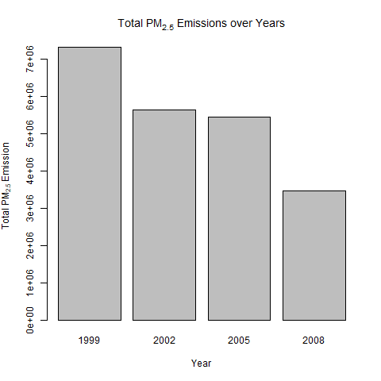
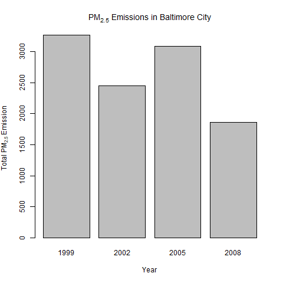
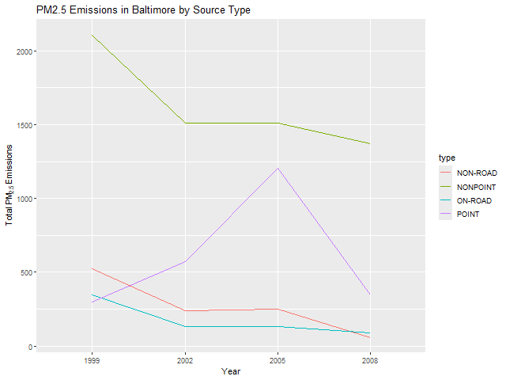
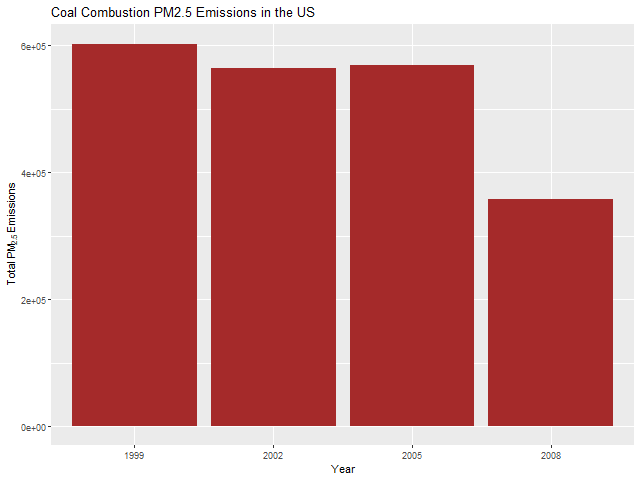
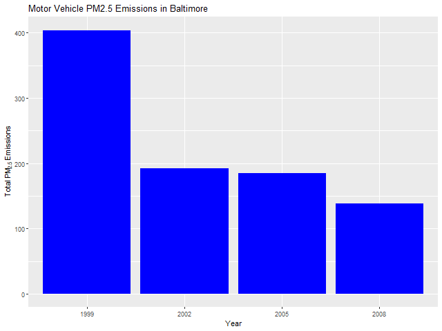
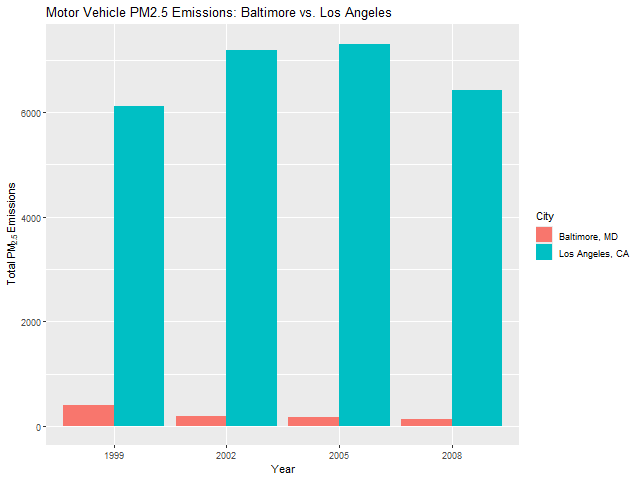

# CourseraExploratoryDataAnalysisJohnsHopkinsUniversityGradedAssignmentCourseProject2
Coursera Exploratory Data Analysis Johns Hopkins University Graded Assignment Course Project 2

# Exploratory Analysis of PM2.5 Emissions

This repository contains my work for the Exploratory Data Analysis assignment. In this project, I examined the National Emissions Inventory (NEI) data to investigate trends in fine particulate matter (PM2.5) emissions in the United States over the years 1999, 2002, 2005, and 2008.

## Background

**Fine particulate matter (PM2.5)** is an ambient air pollutant that is harmful to human health. In the United States, the Environmental Protection Agency (EPA) sets national ambient air quality standards for fine PM and tracks its emissions through the National Emissions Inventory (NEI). Approximately every three years, the EPA releases the NEI database, which records the total tons of PM2.5 emitted from various sources for each year.

The data for this assignment come from the NEI and consist of two files:
- **summarySCC_PM25.rds** – Contains a data frame with PM2.5 emissions data (in tons) for each year.
- **Source_Classification_Code.rds** – Provides a mapping from SCC codes to actual source names and categories.

The variables in the emissions data include:
- **fips:** A five-digit string representing the U.S. county.
- **SCC:** The source classification code.
- **Pollutant:** The pollutant name.
- **Emissions:** The amount of PM2.5 emitted (in tons).
- **type:** The type of source (point, nonpoint, onroad, or nonroad).
- **year:** The year the emissions were recorded.

## Assignment Questions

The overall goal of the assignment was to explore the NEI database and answer the following questions:

1. **Have total emissions from PM2.5 decreased in the United States from 1999 to 2008?**  
   *Plot:* `plot1.png`  
   *Description:* A bar plot (using the base plotting system) showing total PM2.5 emissions across all sources for each year.

   

2. **Have total emissions from PM2.5 decreased in Baltimore City, Maryland (fips == "24510") from 1999 to 2008?**  
   *Plot:* `plot2.png`  
   *Description:* A bar plot (base plotting system) showing total PM2.5 emissions in Baltimore City over time.

   

3. **Of the four types of sources (point, nonpoint, onroad, nonroad), which have seen decreases and which increases in Baltimore City from 1999–2008?**  
   *Plot:* `plot3.png`  
   *Description:* A ggplot2 line plot showing trends by source type in Baltimore City.

   

4. **Across the United States, how have emissions from coal combustion-related sources changed from 1999–2008?**  
   *Plot:* `plot4.png`  
   *Description:* A ggplot2 bar plot showing coal combustion–related PM2.5 emissions over the years.

   

5. **How have emissions from motor vehicle sources changed from 1999–2008 in Baltimore City?**  
   *Plot:* `plot5.png`  
   *Description:* A ggplot2 bar plot showing motor vehicle PM2.5 emissions in Baltimore City.

   

6. **Compare emissions from motor vehicle sources in Baltimore City with those in Los Angeles County, California (fips == "06037"). Which city has seen greater changes over time?**  
   *Plot:* `plot6.png`  
   *Description:* A ggplot2 bar plot comparing motor vehicle emissions in Baltimore and Los Angeles.

   

## Repository Structure

The repository contains the following files:
- **R Code Files:**
  - `plot1.R` – Code to generate `plot1.png`
  - `plot2.R` – Code to generate `plot2.png`
  - `plot3.R` – Code to generate `plot3.png`
  - `plot4.R` – Code to generate `plot4.png`
  - `plot5.R` – Code to generate `plot5.png`
  - `plot6.R` – Code to generate `plot6.png`
- **Plot Image Files:**
  - `plot1.png`
  - `plot2.png`
  - `plot3.png`
  - `plot4.png`
  - `plot5.png`
  - `plot6.png`
- **Data Files:**  
  The data files are stored in the folder:  
  `exdata_data_NEI_data/`
  - `summarySCC_PM25.rds`
  - `Source_Classification_Code.rds`

## How to Reproduce

1. **Clone the repository.**
2. **Ensure the data files** (`summarySCC_PM25.rds` and `Source_Classification_Code.rds`) **are located in the `exdata_data_NEI_data/` folder.**
3. **Run each R script** (e.g., `source("plot1.R")`) in R to reproduce the corresponding plot.  
   Each R script reads the data, processes it, and saves a PNG file with the plot.
4. **Review the images** in the repository to see the output for each question.

## Assignment Criteria

- **Plot Accuracy:** Each plot addresses the respective question and is generated using the appropriate plotting system (base R or ggplot2).
- **Reproducibility:** The R code in each file reads the data, processes it, and produces the PNG plot. The code is self-contained so that anyone with the data can reproduce the results.
- **Clarity and Style:** The plots include clear labels, titles, and legends (where appropriate) to convey the findings.

## Project Summary

This project demonstrates an exploratory analysis of PM2.5 emissions in the United States using the NEI dataset. It investigates trends at the national level, as well as in Baltimore City and Los Angeles County, and breaks down emissions by source type, including coal combustion and motor vehicles. The work highlights changes over the 10-year period (1999–2008) and provides visual evidence to answer key questions about air quality trends.

---

*This assignment was completed as part of the Exploratory Data Analysis course. For any questions or further details, please contact me.*
